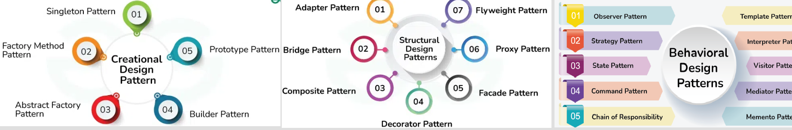

# Design Pattern


Design Patter is used in OOP programming, this page listed all the patterns, logic and example code, here's the index of it.

# Pattern Category 🚀
| Category       | Description                                                                                                                                                  |
| -------------- | ------------------------------------------------------------------------------------------------------------------------------------------------------------ |
| Creational     | to create objects in a manner suitable for the situation. solve design problem by controlling the object creation process                                    |
| Structural     | deal with object composition, creating relationships between objects to form larger structures, ensure no impact to other part if one part of system changed |
| Behavioral     | managing complex control flows in a system with algorithms and the assignment of responsibilities between objects                                            |

## List of Patterns
-  Creational Patterns：- [Singleton](#singleton) - [Factory](#factory) - [Abstract](#abstract) - [Builder](#builder) - [Prototype](#prototype) 
-  Structural Patterns：- [Adapter](#adapter) - [Bridge](#bridge) - [Composite](#composite) - [Flyweight](#flyweight) - [Decorator](#decorator) - [Proxy](#proxy) - [Facade](#facade)
-  Behavioral Patterns：- [Visitor](#VisitorPattern) - [Template](#template) - [Strategy](#strategy) - [State](#state) - [observer](#observer) - [Memento](#memento) - [Mediator](#mediator) - [Command](#command) - [Chain of Responsibility](#chainofresponsibility) - [Interpreter](#interpreter) - [Iterator](#iterator)

## VisitorPattern  
- **Element Interface**: (Employee): Declares the accept method.
- **Concrete Element**: (Engineer, Manager): Implement the accept method to accept a visitor and call the appropriate visit method.
- **Visitor Interface**: (EmployeeVisitor): Defines methods for visiting engineers and managers.
- **Concrete Visitor**: (CompensationVisitor, DetailsVisitor): Implement the specific operations for calculating total compensation and collecting details.
- [Visitor-Employee Hierarchy Example](https://github.com/edpypf/PythonCode/blob/main/DesignPattern/Visitor.py)
```sh
git clone https://github.com/your/repository.git
cd repository
npm install
```
## template

Instructions for setting up the project locally.

```sh
git clone https://github.com/your/repository.git
cd repository
npm install

```markdown


```


## Features ✨

- Feature 1 🎉
- Feature 2 🚀
- Feature 3 🛠

 
